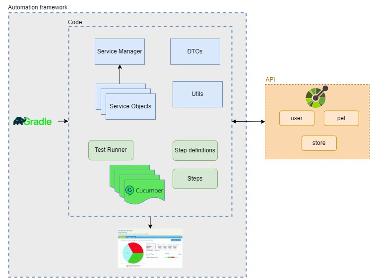

# Home Challenge - PetStore

The purpose of this Test Automation Project is to showcase how RestAssured works by using Service Object pattern.

Prerequisites:
- Java 16 or higher
- Gradle 8.0 or higher


### Project directory structure
Build system is based on Gradle, following the directory structure according to the design pattern proposed:
```Gherkin
src
  + main
    + java
      + com.petstore.qa
        + dto                     POJOs
        + enums
        + services                Services as Objects
  + test
    + java 
      + com.petstore.qa
        + common
        + runner                  Test runner
        + stepdefinitions         Steps defined in feature files
        + steps                   Concrete steps (implementation)
        + utils                   Utility class to generate random data
    + resources
      + features                  Feature files
          pets.feature
          store.feature
          user.feature
      + schemas                   JSON schemas
      serenity.conf
```



### Installation:
- Clone the repository from [Github](https://github.com)
- Run command ```./gradlew build``` to install all dependencies

This suite can be easily run via command line by following the next steps:
- Test suite: ```./gradlew clean test```

### Reports
Automation suite generates two types of reports automatically
- Emailable report - short summary about test execution results
- Complete report